  

# 🍽️ Awesome Restaurant Workforce Management 📋

  
  
  
  
  
  

> A curated directory of premier **Restaurant Workforce Management (WFM)** SaaS platforms, shift scheduling software, and open-source GitHub projects. Designed for restaurant operators, managers, and hospitality leaders seeking tools for **employee shift scheduling**, **automated rotas**, **time & attendance tracking**, **labor cost forecasting**, **tip pooling & distribution**, and **frontline team communication**.

**Last updated: September 2026**

---

### 🔍 Overview & Industry Focus

This repository catalogs top-tier commercial **SaaS platforms** and notable **open-source repositories** purpose-built for **Restaurant & Hospitality Workforce Management**. Effective workforce management systems help independent restaurants, multi-unit franchises, bars, and ghost kitchens streamline hourly labor schedules, manage staff availability and shift trades, track digital punch-clocks, maintain labor-law compliance (such as Fair Workweek regulations), forecast labor spend against POS sales, and automate tip payouts.

- **Market Leaders & Category Giants**: Leading enterprise and SMB platforms include **Fourth**, **HotSchedules**, **Deputy**, **Homebase**, **When I Work**, **7shifts**, **Harri**, **Planday**, **Sling**, **Push Operations**, and **ZoomShift**.
- **Open-Source Landscape**: Mature restaurant WFM with native POS integrations, automated predictive scheduling, and tip compliance is largely commercial. However, robust open-source foundations exist across modular ERPs (Odoo, ERPNext), dedicated restaurant systems (TastyIgniter, URY), shift optimization frameworks (Timefold, OptaPlanner, OR-Tools), and standalone self-hosted scheduling utilities.

---

## 📑 Table of Contents

- [🏢 SaaS / Hosted Platforms](#-saas--hosted-platforms)
- [💻 Open-Source GitHub Projects](#-open-source-github-projects)
- [🛠️ Additional Strong Open-Source Building Blocks](#️-additional-strong-open-source-building-blocks)
- [🤝 How to Contribute](#-how-to-contribute)
- [📈 Star History](#-star-history)
- [⚖️ Disclaimer](#-disclaimer)

---

## 🏢 SaaS / Hosted Platforms

> 📊 **Market Size & Industry Dynamics**: The global restaurant workforce management and employee scheduling software sector is valued at approximately **$6.8 Billion** (projected to expand past **$18.5 Billion** by 2033 at a **12.4% CAGR**). The sector is currently **moderately fragmented** and experiencing dynamic consolidation: rather than a single winner-take-all monopoly, specialized best-in-breed scheduling platforms (e.g., 7shifts, Deputy) compete and integrate alongside expanding mega-suites and POS ecosystems (e.g., Fourth, Toast).

| Platform | Company Size (Valuation / Revenue) | Key Focus & Capabilities | Pricing (Starting Tier) | Free Tier / Free Trial Limits |
| :--- | :--- | :--- | :--- | :--- |
| **[Fourth (Enterprise Suite)](https://www.fourth.com/)** | **~$1.8B–$2.0B Est. Valuation** / ~$300M ARR (Backed by Marlin Equity Partners & Insight Partners; powers 120,000+ hospitality locations globally) | Enterprise hospitality management combining demand forecasting, scheduling, inventory, and payroll. | Starts at **$500.00/mo** (typical entry minimum for mid-market/enterprise deployment, scaling to ~$3.00–$5.00/employee/mo based on module volume). | **Guided proof-of-concept pilot / demo sandbox** arranged during enterprise consultation (no public self-service trial; no permanent free tier). |
| **[HotSchedules (Fourth)](https://www.hotschedules.com/)** | **~$1.8B–$2.0B Est. Valuation** / ~$300M ARR (Flagship restaurant scheduling platform under Fourth Enterprises) | Demand-driven scheduling, labor forecasting, compliance enforcement, and multi-unit restaurant management. | Starts at **$40.00/location/mo** (base scheduling tier for up to 30 users, or ~$2.00–$4.00/user/mo depending on unit scale; +$2.99 one-time employee mobile app fee). | **30-day free trial** available upon scheduling a demo and sales consultation (no permanent free tier). |
| **[Deputy](https://www.deputy.com/)** | **~$1.1B Valuation** (Unicorn status) / ~$120M ARR (Raised $100M+; backed by IVP, OpenView, & General Catalyst) | Shift-based workforce management, timesheets, break planning, labor compliance, and team communication. | Starts at **$5.00/user/mo** (Lite plan; $30.00/mo account minimum spend) or $4.50/user/mo (Scheduling-only tier). | **31-day free trial** with full access to Core and Pro features, unlimited users (no credit card required; no permanent free tier). |
| **[Homebase](https://www.joinhomebase.com/)** | **~$600M–$700M Est. Valuation** / ~$70M+ ARR (Raised $108M+ total funding; backed by Emerson Collective) | Hourly staff scheduling, POS-integrated time clock, shift messaging, and automated shift reminders. | Starts at **$24.00/location/mo** (billed annually) or $30.00/mo (billed monthly) for Essentials tier (unlimited employees at 1 location). | **Free-forever plan ("Basic")** for 1 location & up to 10 employees (basic scheduling, time tracking, POS integration, and messaging). Paid tiers offer a **14-day free trial** of All-in-One features (no credit card required). |
| **[When I Work](https://wheniwork.com/)** | **~$500M Est. Valuation** / ~$60M+ ARR (Secured $200M growth investment from Bain Capital Tech Opportunities) | Drag-and-drop schedule builder, mobile punch clock, geofencing, shift trading, and team chat. | Starts at **$2.50/user/mo** (billed annually) or $3.00/user/mo (billed monthly) for Standard Scheduling; $4.00/user/mo with Time & Attendance. | **14-day free trial** with full platform access for up to 75 users (no credit card required; no permanent free tier). |
| **[7shifts](https://www.7shifts.com/)** | **~$400M Est. Valuation** / ~$45M+ ARR (Raised $100M+ total; Series C led by SoftBank Vision Fund 2) | Restaurant-focused scheduling, time tracking, labor budgeting, POS integration, and tip pooling. | Starts at **$39.99/location/mo** (billed annually) or $43.99/mo (billed monthly) for Essentials tier (up to 30 employees). | **Free-forever plan ("Comp")** for 1 location & up to 30 employees (basic scheduling & team announcements; excludes time clocking & POS integration). Paid tiers offer a **14-day free trial** (no credit card required). |
| **[Harri](https://harri.com/)** | **~$250M–$300M Est. Valuation** / ~$35M–$40M ARR (Raised $43M+; backed by hospitality venture leaders) | Frontline hospitality suite covering talent acquisition, scheduling, labor compliance, and biometric time clocks. | Starts at **$75.00/mo** for entry single-location modules (or ~$5.00–$8.00/employee/mo for mid-market; ~$875.00/mo base for 100-employee full-suite deployments). | **14-to-30-day guided pilot / sandbox trial** provided following a demo and sales evaluation (no self-service trial; no permanent free tier). |
| **[Planday](https://www.planday.com/)** | **~$188M Valuation** (€155M acquisition by Xero) / ~$30M+ ARR | Shift rota management, punch-clock attendance, wage forecasting, and leave/absence management. | Starts at **$2.99/user/mo** (Starter plan with a 5-user minimum = $14.95/mo minimum spend). | **30-day free trial** with full access to Plus tier scheduling and reporting tools (no credit card required; no permanent free tier). |
| **[Sling](https://getsling.com/)** | **Acquired by Toast ($15B+ Market Cap)**; ~$40M–$60M standalone / ~$12M ARR | Shift scheduling, shift trading, employee availability tracking, internal newsfeed, and labor cost controls. | Starts at **$1.70/user/mo** (billed annually) or $2.00/user/mo (billed monthly) for Premium tier. | **Free-forever plan** for up to 30 users at 1 location (includes shift scheduling, availability, shift swaps, and mobile view; excludes time tracking & overtime alerts). Paid tiers include a **15-day free trial**. |
| **[Push Operations](https://www.pushoperations.com/)** | **~$40M–$50M Est. Valuation** / ~$10M–$15M ARR (Restaurant-specific workforce & payroll platform) | Restaurant workforce management platform integrating scheduling, labor analytics, and restaurant payroll. | Starts at **$5.00/employee/mo** (minimum 5 employees = $25.00/mo minimum spend). | **14-day guided proof-of-concept trial** upon booking a consultation and demo (no public self-service trial; no permanent free tier). |
| **[ZoomShift](https://www.zoomshift.com/)** | **~$15M–$25M Est. Valuation** / ~$4M–$6M ARR (Bootstrapped, profitable workforce SaaS) | Web and mobile shift scheduling, GPS time clock, timesheet management, and payroll exports for hourly teams. | Starts at **$2.00/user/mo** (billed annually) or $2.50/user/mo (billed monthly) for Starter tier. | **Free-forever plan ("Essentials")** for 1 location & up to 20 employees (basic schedule calendar and timesheets; excludes geofencing & auto-scheduling). Paid tiers offer a **14-day free trial** (no credit card required). |

## 💻 Open-Source GitHub Projects

- **[Odoo](https://github.com/odoo/odoo)**   
  Modular enterprise suite featuring official open-source modules for Point of Sale (POS), restaurant table layouts, shift planning, attendance punch tracking, and leave management.

- **[ERPNext](https://github.com/frappe/erpnext)**   
  Comprehensive open-source ERP featuring complete human resources management, shift assignments, shift request workflows, attendance check-ins, payroll processing, and restaurant operation features.

- **[TastyIgniter](https://github.com/tastyigniter/TastyIgniter)**   
  Popular open-source restaurant management and online ordering platform with built-in staff role permissions, kitchen display workflows, table reservations, and extensible shift management.

- **[Staffjoy v2](https://github.com/Staffjoy/v2)**   
  Open-source workforce scheduling suite built with Go, gRPC, React, and microservices architecture designed to automate scheduling, attendance, and worker communication.

- **[TimeOff Management](https://github.com/timeoff-management/timeoff-management-application)**   
  Self-hosted employee absence and time-off management web application with team leave calendars, multi-department approval flows, and calendar sync (iCal, Google Calendar, Outlook).

- **[Timefold Quickstarts](https://github.com/timefoldai/timefold-quickstarts)**   
  AI constraint solver implementing automated employee shift rostering and staff scheduling with availability rules, labor laws, and overtime optimization.

- **[URY – Open Source Restaurant Management](https://github.com/ury-erp/ury)**   
  FOSS restaurant management system built on ERPNext, covering POS, kitchen display system (KDS), and operational workflows adaptable for restaurant staff and shift assignments.

- **[RestaurantProject](https://github.com/BryanTheLai/RestaurantProject)**   
  C++ object-oriented restaurant management platform handling table management, employee staff schedules, and billing workflows.

- **[OptaPlanner Quickstarts](https://github.com/kiegroup/optaplanner-quickstarts)**   
  Constraint satisfaction quickstarts for AI-driven employee rostering, shift rotation, and hospital/hospitality workforce management.

- **[Shift Schedule (OR-Tools)](https://github.com/weiran-aitech/shift_schedule)**   
  Constraint programming model using Google OR-Tools for modeling and solving employee shift scheduling and rota generation.

- **[Shift Scheduler](https://github.com/oasido/shift-scheduler)**   
  Web application for employee shift planning, absence tracking, and dynamic rota management for small-to-medium hourly teams.

- **[D-Wave Employee Scheduling](https://github.com/dwave-examples/employee-scheduling)**   
  Quadratic unconstrained binary optimization (QUBO) model solving employee scheduling constraints and shift preferences.

- **[TimeTables](https://github.com/dlsnyder8/TimeTables)**   
  Open-source employee shift scheduling and management application with availability input, algorithmic schedule generation, group support, and notifications.

- **[Restaurant Staff Scheduling Prototype](https://github.com/marcpage/scheduling)**   
  Restaurant staff scheduling prototype for availability collection, shift distribution, and manager–employee communication.

- **[Workshift](https://github.com/saccofrancesco/workshift)**   
  Modern desktop application built with Tauri and Next.js for smart shift scheduling and real-time hourly workforce tracking.

- **[EmployeeScheduler](https://github.com/cadillaclizard/EmployeeScheduler)**   
  Community project implementing basic employee and restaurant shift scheduling interfaces.

- **[FrescoByMeobel](https://github.com/chocuuuu/FrescoByMeobel)**   
  Full-stack restaurant workforce management example integrating shift attendance, payroll computation, and weekly schedule coordination.

- **[AIMMS Employee Scheduling](https://github.com/aimms/employee-scheduling)**   
  Open mathematical optimization model focused on cost-effective staff placement across restaurant locations and skill requirements.

---

### 🛠️ Additional Strong Open-Source Building Blocks

- 📅 **Calendar & Availability Libraries**: Open UI components (e.g. FullCalendar, react-big-calendar) for constructing responsive shift grids and employee swap boards.
- 🔔 **Notification & Messaging Engines**: Self-hosted chat (e.g., Matrix, Rocket.Chat) and push webhook services for automated shift call-outs and schedule release notifications.
- ⏱️ **Time-Clock & Kiosk Integrations**: Open-source punch-clock, RFID badge, and biometric hardware SDK integrations feeding actual hours into timesheets.
- 📊 **Labor Cost Calculators & Forecasting Scripts**: Python/Pandas models predicting hourly labor demands from historical POS ticket volumes.
- 📱 **Progressive Web App (PWA) Templates**: Mobile-first interfaces enabling front-of-house and back-of-house staff to view schedules and submit time-off requests.

---

## 🤝 How to Contribute

1. 🍴 Fork the repository.
2. 📝 Add or update entries in `README.md` (maintain consistent tabular and star-sorted formatting).
3. 🔍 Provide accurate details: platform/repo name, verified URL, clear description, exact pricing, and specific free tier/trial limits.
4. 🚀 Submit a Pull Request (PR) with a brief summary of the addition.

⭐ **Star this repository** if you find it helpful for your restaurant, bar, hotel, or hospitality workforce tech stack!

---

## 📈 Star History

---

## ⚖️ Disclaimer

- 📌 This is a **community-curated** list for educational and informational purposes — not an official endorsement.
- 🔒 Workforce management platforms handle sensitive employee records, biometric punches, and payroll calculations. Compliance with Fair Workweek laws, local labor regulations, and data security standards remains the operator's responsibility.
- ⚙️ Open-source alternatives offer zero seat fees and architectural ownership but necessitate server hosting, database maintenance, and security monitoring. Always evaluate total cost of ownership (TCO) before deployment.

---

**Made with ❤️ for restaurant operators, multi-unit managers, hospitality HR leaders, and shift-based workforce innovators.**
